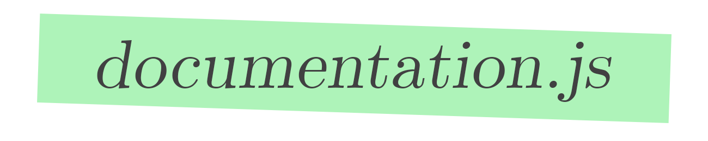

<p align="center">
  
</p>

<p align="center">
  The documentation system for modern JavaScript
</p>

[](https://circleci.com/gh/documentationjs/documentation/tree/master)
[](http://badge.fury.io/js/documentation)
[](https://gitter.im/documentationjs/documentation?utm_source=badge&utm_medium=badge&utm_campaign=pr-badge)
[](https://david-dm.org/documentationjs/documentation)
[](http://inch-ci.org/github/documentationjs/documentation)

[:date: Current maintenance status](https://github.com/documentationjs/documentation/wiki/Current-maintenance-status)

* Supports modern JavaScript: ES5, ES2017, JSX, Vue and [Flow](https://flow.org/) type annotations.
* Infers parameters, types, membership, and more. Write less documentation: let the computer write it for you.
* Integrates with GitHub to link directly from documentation to the code it refers to.
* Customizable output: HTML, JSON, Markdown, and more

## Examples

-   [HTML output with default template](https://documentation.js.org/html-example/)
-   [Markdown](https://github.com/documentationjs/documentation/blob/master/docs/NODE_API.md)
-   [JSON](https://documentation.js.org/html-example/index.json)

## Documentation

-   [Getting Started](docs/GETTING_STARTED.md): start here
-   [Usage](docs/USAGE.md): how to use documentation.js
-   [Recipes](docs/RECIPES.md): tricks for writing effective JSDoc docs
-   [Node API](docs/NODE_API.md): documentation.js's self-generated documentation
-   [Configuring documentation.js](docs/CONFIG.md)
-   [FAQ](docs/FAQ.md)
-   [Troubleshooting](docs/TROUBLESHOOTING.md)
-   [Theming](docs/THEMING.md): tips for theming documentation output in HTML
-   [See also](https://github.com/documentationjs/documentation/wiki/See-also): a list of projects similar to documentation.js

## User Guide

Globally install `documentation` using the [npm](https://www.npmjs.com/) package manager:

```sh
$ npm install -g documentation
```

This installs a command called `documentation` in your path, that you can
point at [JSDoc](http://usejsdoc.org/)-annotated source code to generate
human-readable documentation. First, run `documentation` with the `--help`
option for help:

```sh
Usage:

# generate markdown docs for index.js and files it references
documentation build index.js -f md

# generate html docs for all files in src, and include links to source files in github
documentation build src/** -f html --github -o docs

# document index.js, ignoring any files it requires or imports
documentation build index.js -f md --shallow

# build and serve HTML docs for app.js
documentation serve app.js

# build, serve, and live-update HTML docs for app.js
documentation serve --watch app.js

# validate JSDoc syntax in util.js
documentation lint util.js

# update the API section of README.md with docs from index.js
documentation readme index.js --section=API

# build docs for all values exported by index.js
documentation build --document-exported index.js

# build html docs for a TypeScript project
documentation build index.ts --parse-extension ts -f html -o docs

Commands:
  serve [input..]   generate, update, and display HTML documentation
  build [input..]   build documentation
  lint [input..]    check for common style and uniformity mistakes
  readme [input..]  inject documentation into your README.md

Options:
  --version  Show version number                                       [boolean]
  --help     Show help                                                 [boolean]
```

## [Contributing](CONTRIBUTING.md)

_We have plenty of
[issues](https://github.com/documentationjs/documentation/issues) that we'd
love help with._

-   Robust and complete `JSDoc` support, including typedefs.
-   Strong support for HTML and Markdown output
-   Documentation coverage, statistics, and validation

documentation is an OPEN Open Source Project. This means that:

Individuals making significant and valuable contributions are given
commit-access to the project to contribute as they see fit. This
project is more like an open wiki than a standard guarded open source project.
